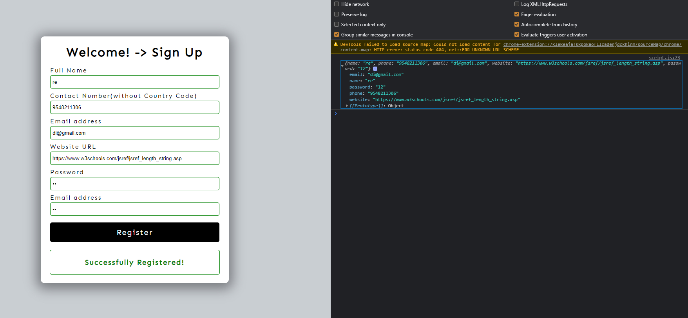

# JS Projects
## Client Side Form Validation

Form Validation using HTML5 and JS.

- CSS change on correct/wrong input
- Checking passwords, phone number using JS
- Checking rest of the inputs using HTML Constraint API
- Showing response message accordingly
- After successfull submission, submitted data can be observed in console as in Image below.

